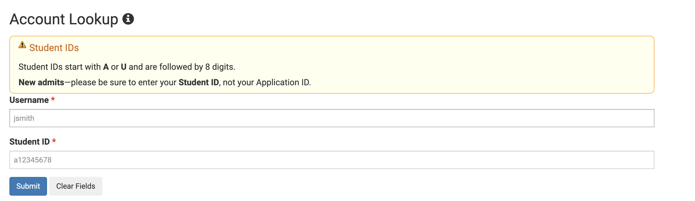
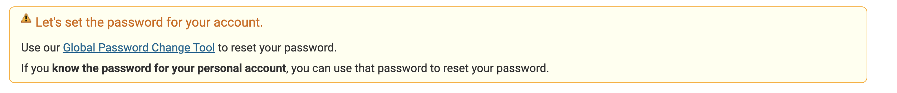
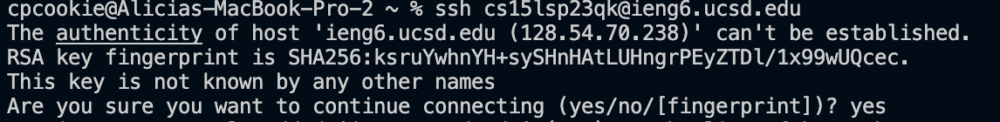
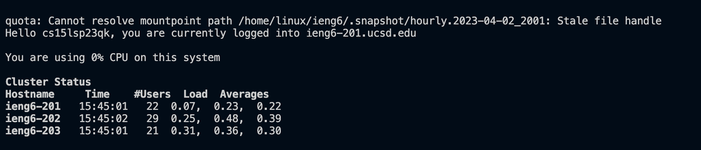

# Lab Report 1 - Remote Access and FileSystem (Week 1)

## How to Log Into a Course-Specific Account on ieng6
1. Find your course-specific account through this [link](https://sdacs.ucsd.edu/~icc/index.php).
This is so you can find the username needed when you log into the remote access.
3. Log into the account lookup section using your UCSD username and student PID.
  
  Your ucsd username should be the same one you use to log into your TritonLink account for school. 
3. Scroll down to the `Additional Accounts` section and look for the username that starts with `cs15l`. Make sure it's `cs15l` and not `cs12`.
4. Click on the username and you'll be led to a new page where you have the option to change your password. Click on it.
  
5. Once you click on the option, you'll be led to a new page to change your password. Click on the option that says `Proceed to the Password Change Tool`.
6. Enter the username of the cse15l account and follow the instructions to change its password on the page. You may have to pull up your gmail when it sends a confirmation to your inbox. Make sure to check your spam inbox if you don't see it there.
7. Open VS Code and open up a new terminal. For Macs, to open a new terminal, go to the bar above in the left corner and click terminal > New Terminal.
8. Into the terminal, type in `$ ssh cs15lsp23xxieng6.ucsd.edu` where the **xx** is your course-specific account username's **last two characters**. Everything before the *ieng6.ucsd.edu* should just be your course-specific account username that you looked up earlier.
9. You'll get a prompt that looks like this:
  
  Type yes and then enter. Then enter your computer's password.
10. Congratulations! You'll have logged into your course-specific account when you see this: 
 
 ---

