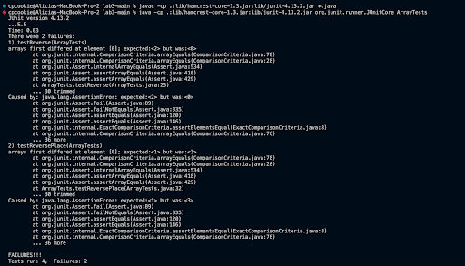

# Week 3 Lab Report 2

## Part 1
`StringServer.java code`


`Example 1`


`Descriptions:`

1. Methods called:
* Server.start()
* integer.parseInt()
* main()
* handleRequest()
* url.getPath()
* url.getQuery()
* String.format()
2. Arguments for each:
* Server.start(port, new ServerHandler())
* integer.parseInt(args[0])
* main(String[] args)
* handleRequest(URI url)
* url.getPath()
* url.getQuery()
* String.format(message)
Relevant fields:
* String message = "";
3. The field named message had its value "" changed when updated with different requests in the URL. It got updated  with a new line concatenated to it and the new requested strings. 


`Example 2`


`Descriptions:`


1. Methods called:
* Server.start()
* integer.parseInt()
* main()
* handleRequest()
* url.getPath()
* url.getQuery()
* String.format()
2. Arguments for each:
* Server.start(port, new ServerHandler())
* integer.parseInt(args[0])
* main(String[] args)
* handleRequest(URI url)
* url.getPath()
* url.getQuery()
* String.format(message)
Relevant fields:
* String message = "";
3. The field named message had its value "" changed when updated with different requests in the URL. It got updated  with a new line concatenated to it and the new requested strings onto the running string. 


## Part 2
Lab 3 Bug: reverseInPlace method
* Failure-Inducing Input
```
public void testReversePlace() {
    int[] input2 = {1, 2, 3};
    ArrayExamples.reverseInPlace(input2);
    assertArrayEquals(new int[]{3, 2, 1}, input2);
  } 
```
* Non Failure-Inducing Input
```
public void testReverseInPlace() {
    int[] input1 = { 3 };
    ArrayExamples.reverseInPlace(input1);
    assertArrayEquals(new int[]{ 3 }, input1);
	}
```
* Symptom



* Bug


Before:
```
 static void reverseInPlace(int[] arr) {
    for(int i = 0; i < arr.length; i += 1) {
      arr[i] = arr[arr.length - i - 1];
    }
  }
```
After:
```
static void reverseInPlace(int[] arr) {
    for(int i = 0; i < (arr.length / 2); i += 1) {
      int first = arr[0];
      arr[i] = arr[arr.length - i - 1];
      arr[arr.length - i - 1] = first; 

    }
  }
```

The fix addresses the issue because before, the bug would skip over the element at index 0 so it wouldn't be reversed. After the fix, the element at index 0 would get correctly stored and wouldn't be skipped over when reversing. 


## Part 3
From week 2 in lab, I learned how to make a web server and update it with different numbers in the search bar. It was really interesting to see the web server increment and save its previous value after incrementing it a multitude of times.
