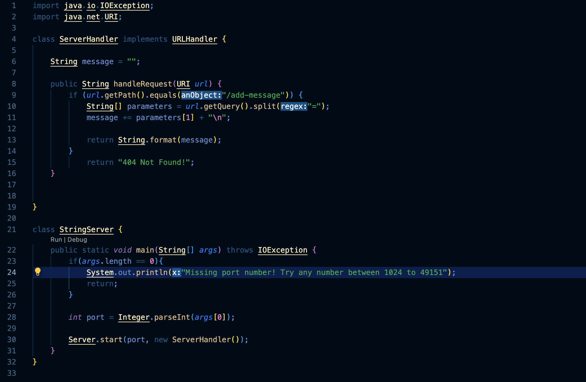
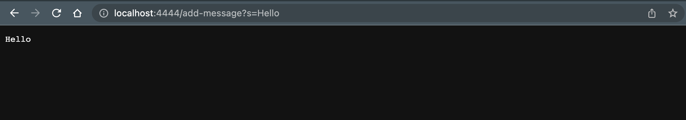
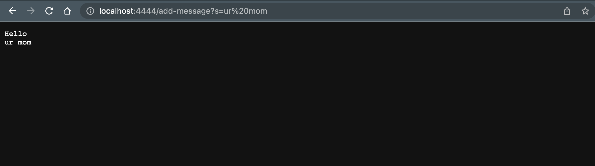

# Week 3 Lab Report 2

## Part 1
`StringServer.java code`

`Example 1`

`Descriptions:`

1. Methods called:
* Server.start()
* integer.parseInt()
* main()
* handleRequest()
* url.getPath()
* url.getQuery()
* String.format()
2. Arguments for each:
* Server.start(port, new ServerHandler())
* integer.parseInt(args[0])
* main(String[] args)
* handleRequest(URI url)
* url.getPath()
* url.getQuery()
* String.format(message)
Relevant fields:
* String message = "";
3. The field named message had its value "" changed when updated with different requests in the URL. It got updated  with a new line concatenated to it and the new requested strings. 

`Example 2`

`Descriptions:`

1. Methods called:
* Server.start()
* integer.parseInt()
* main()
* handleRequest()
* url.getPath()
* url.getQuery()
* String.format()
2. Arguments for each:
* Server.start(port, new ServerHandler())
* integer.parseInt(args[0])
* main(String[] args)
* handleRequest(URI url)
* url.getPath()
* url.getQuery()
* String.format(message)
Relevant fields:
* String message = "";
3. The field named message had its value "" changed when updated with different requests in the URL. It got updated  with a new line concatenated to it and the new requested strings onto the running string. 
