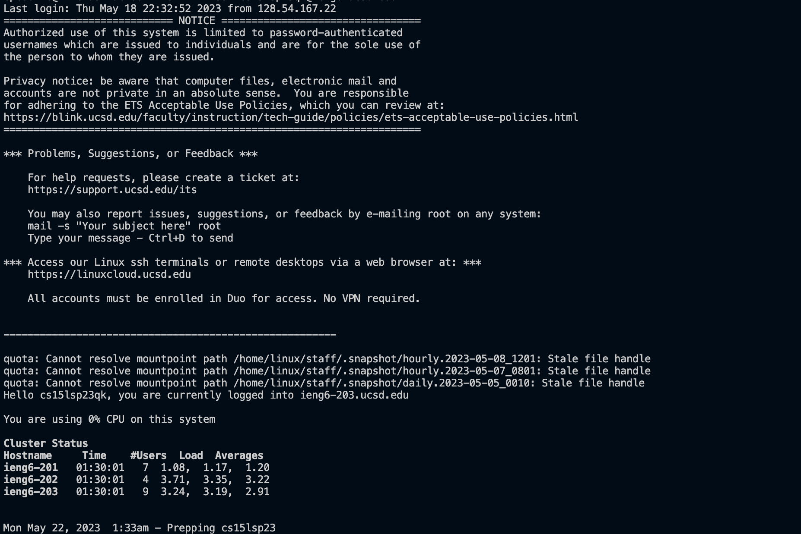
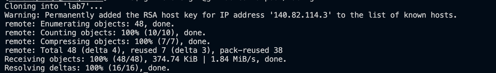
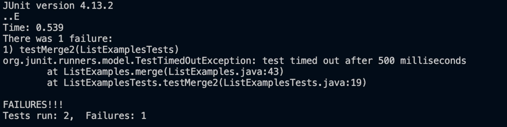
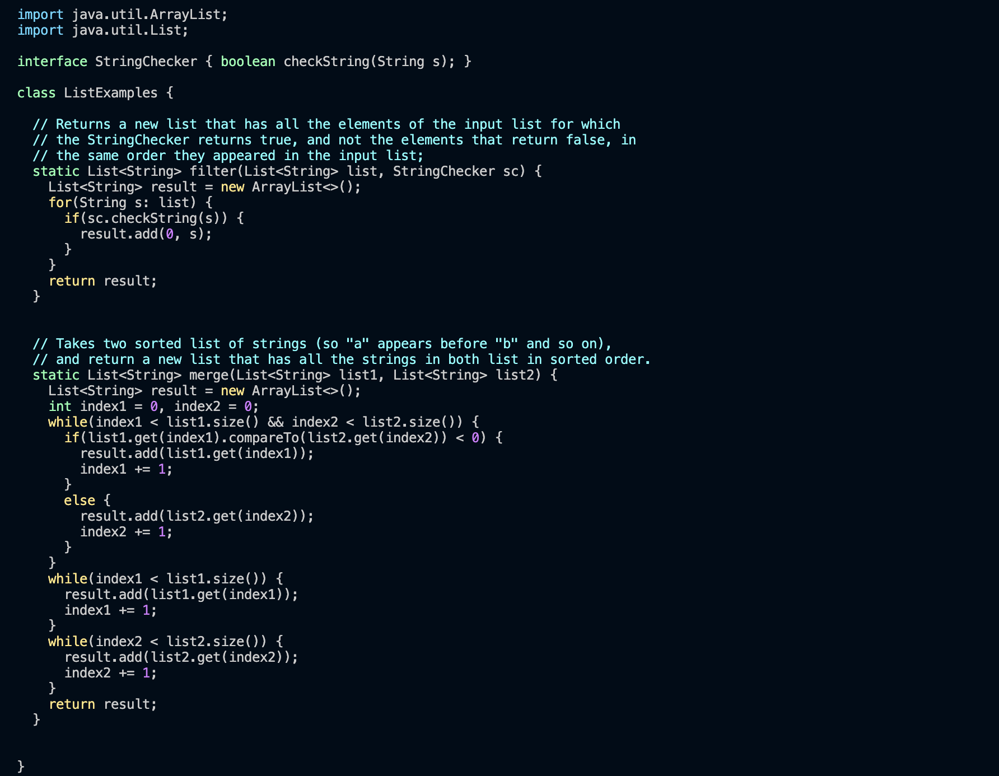
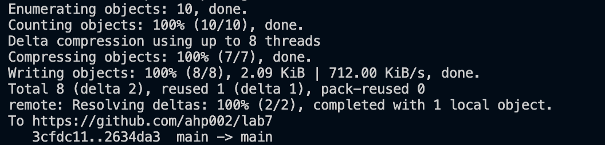

# Lab Report 4 (Week 7)

4.



Keys Pressed:

```
ssh<space>cs15lsp23qk@ieng6.ucsd.edu<enter>
I logged into my ieng6 account.

```


5. 



Keys Pressed:
```
git<space>clone<space>git@github.com:ahp002/lab7.git<enter>
I cloned the ssh link of the lab7 forked repository.
```

6.



Keys Pressed:
```
cd<space>lab7<enter>
bash<space>test.sh<enter>
I switched to the lab7 repository and ran the tests in it.
```

7.



Keys Pressed:
```
vim<space>ListExamples.java<enter>/+<enter>nnnhhxi2<esc>:wq<enter>
I used vim to edit the file, pressed the / key to search for the + sign in the file and pressed the n key 3 times 
to take me to the third + sign that matched my search, h twice to go left, x to remove, i to insert 2 and then pressed the esc key to exit
insert mode, then saved and quit from vim using :wq.
```

8.


Keys Pressed:
```
<up><up><enter>
The bash test.sh command was 2 up in the history so I used the up arrow key to access it and run it.
```

9.




Keys Pressed:
```
git<space>add<space>ListExamples.java<enter>
git<space>commit<space>-m<space>"update"<enter>
git<space>push<space>origin<space>main<enter>
I added the file I changed to the current directory and commited it with the message "update". Then 
I pushed the resulting change to my Github account.
```
