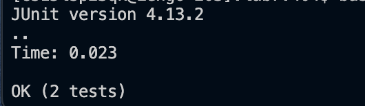

# Lab Report 4 (Week 7)

four.


Keys Pressed:

```
ssh<space>cs15lsp23qk@ieng6.ucsd.edu<enter>
I logged into my ieng6 account.

```


five.


Keys Pressed:
```
git<space>clone<space>git@github.com:ahp002/lab7.git<enter>
I cloned the ssh link of the lab7 forked repository.
```

six.


Keys Pressed:
```
cd<space>lab7<enter>
bash<space>test.sh<enter>
I switched to the lab7 repository and ran the tests in it.
```

seven. 


Keys Pressed:
```
vim<space>ListExamples.java<enter>/+<enter>nnnhhxi2<esc>:wq<enter>
I used vim to edit the file, searched the + to get to the error quicker, used n 3 times to get to the closest + sign to the error, h twice to go left, x to remove, i to insert 2 and then escaped to exit insert mode, then saved and quit from vim
```

eight. 



Keys Pressed:
```
<up><up><enter>
The bash test.sh command was 2 up in the history so I used the up arrow key to access it and run it.
```

nine. 


Keys Pressed:
```
git<space>add<space>ListExamples.java<enter>
git<space>commit<space>-m<space>"update"<enter>
git<space>push<space>origin<space>main<enter>
I added the file I changed to the current directory and commited it with the message "update". Then I pushed the resulting change to my Github account.
```
