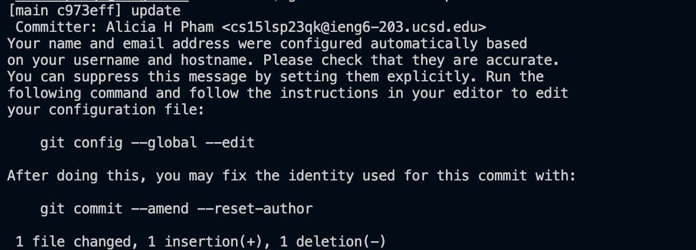

# Lab Report 4 (Week 7)

4. Keys Pressed:

```
ssh<space>cs15lsp23qk@ieng6.ucsd.edu<enter>
*Password*<enter>

```


5. Keys Pressed:
```
git<space>clone<space>git@github.com:ahp002/lab7.git<enter>
```


6. Keys Pressed:
```
cd<space>lab7<enter>
bash<space>test.sh<enter>
```


7. Keys Pressed:
```
vim<space>ListExamples.java<enter>/+<enter>nnnhhxi2<esc>:wq<enter>
```


8. Keys Pressed:
```
<up><up><enter>
The bash test.sh command was 2 up in the history so I used the up arrow key to access it.
```


9. 
```
git<space>add<space>ListExamples.java<enter>
git<space>commit<space>-m<space>"update"<enter>
git<space>push<space>origin<space>main<enter>
```




