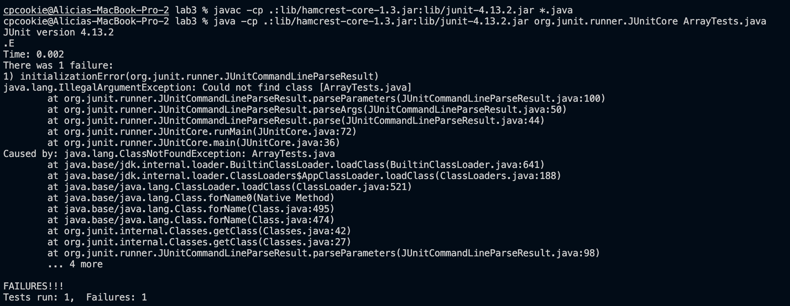
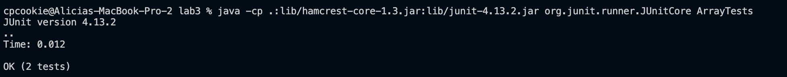

# Lab Report 5 (Week 9)
## Part 1
**What environment are you using (computer, operating system, web browser, terminal/editor, and so on)?**
* I'm using the Visual Studio Code editor on my MacBook Pro that's on the macOS Monterey.

**Detail the symptom you're seeing. Be specific; include both what you're seeing and what you expected to see instead. Screenshots are great, copy-pasted terminal output is also great. Avoid saying “it doesn't work”.**

* I see 1 test run, 1 test failed, and an initializationError(org.junit.runner.JUnitCommandLineParseResult) failure with a java.lang.IllegalArgumentException being caused by java.lang.ClassNotFoundException: ArrayTests.java. I expected to see 2 tests ran without any failures. 

**Detail the failure-inducing input and context. That might mean any or all of the command you're running, a test case, command-line arguments, working directory, even the last few commands you ran. Do your best to provide as much context as you can.**

* I ran the commands `javac -cp .:lib/hamcrest-core-1.3.jar:lib/junit-4.13.2.jar *.java` which compiled successfully and `java -cp .:lib/hamcrest-core-1.3.jar:lib/junit-4.13.2.jar org.junit.runner.JUnitCore ArrayTests.java` which produced the symptom of 1 test ran and 1 test failed along with the initializationError, java.lang.IllegalArgumentException, and java.lang.ClassNotFoundException. I'm in the working directory /Users/cpcookie/Documents/GitHub/lab3. I think the failure-inducing input might be within the command line because it couldn't find the class ArrayTests.java when I ran the second command. The class is within the correct file though so the bug can't be within ArrayTests.java.

**TA's Response:** 
* Instead of running the second command with ArrayTests.java, why don't you try running with ArrayTests instead?

**Screenshot/terminal output showing what information the student got from trying that, and a clear description of what the bug is.**
* The bug is within the second command I ran. Instead of running ArrayTests.java in the command line with jUnit, I ran ArrayTests like so: `java -cp .:lib/hamcrest-core-1.3.jar:lib/junit-4.13.2.jar org.junit.runner.JUnitCore ArrayTests`.

**Setup Information**
* The file & directory structure needed:
* The contents of each file before fixing the bug:
* The full command line (or lines) you ran to trigger the bug:
* A description of what to edit to fix the bug:

## Part 2

