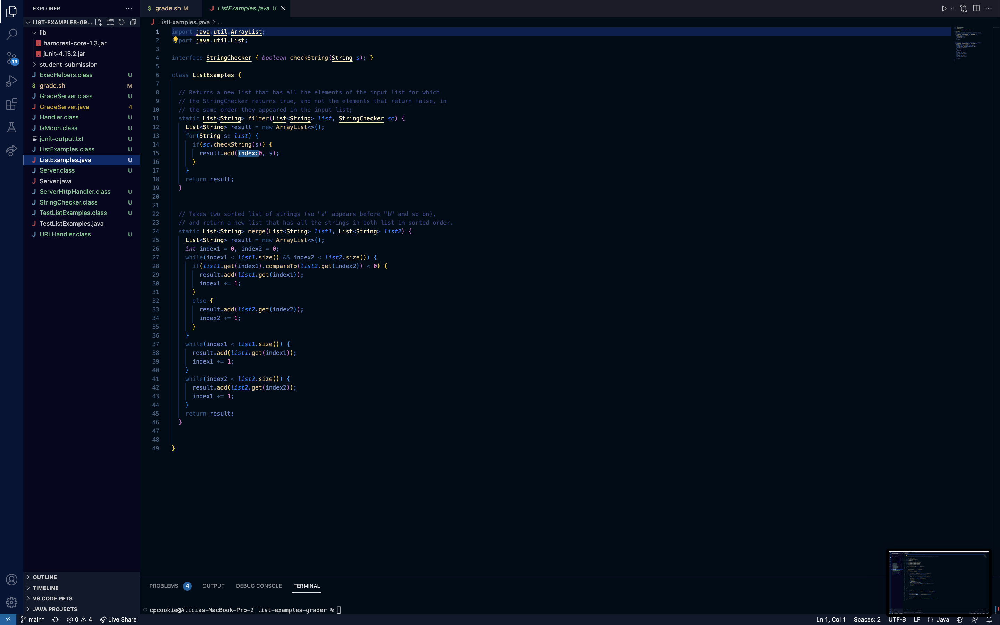

# Lab Report 5 (Week 9)
## Part 1
**What environment are you using (computer, operating system, web browser, terminal/editor, and so on)?**
* I'm using the Visual Studio Code editor on my MacBook Pro that's on the macOS Monterey.


**Detail the symptom you're seeing. Be specific; include both what you're seeing and what you expected to see instead. Screenshots are great, copy-pasted terminal output is also great. Avoid saying “it doesn't work”.**


* I see 4 tests passed, a student's github repository successfully cloned, and an Exception in thread "main" java.lang.NoClassDefFoundError caused by java.lang.ClassNotFoundException: org.hamcrest.SelfDescribing. I expected to see 4 tests ran with 2 failures, a score of 2/4, and a student's github repository successfully cloned. 


**Detail the failure-inducing input and context. That might mean any or all of the command you're running, a test case, command-line arguments, working directory, even the last few commands you ran. Do your best to provide as much context as you can.**


* I ran the command `bash grade.sh https://github.com/ucsd-cse15l-f22/list-methods-lab3` which produced the symptom of 4 tests passed along with a student's github repository successfully cloned and an Exception in thread "main" java.lang.NoClassDefFoundError caused by java.lang.ClassNotFoundException: org.hamcrest.SelfDescribing. I'm in the working directory `/Users/cpcookie/Documents/GitHub/list-examples-grader`. I think the failure-inducing input might be within the bash file because the failure was caused by org.hamcrest.SelfDescribing and the bash file doesn't have the .jar command structure that junit requires to run commands:

```
javac -cp .:lib/hamcrest-core-1.3.jar:lib/junit-4.13.2.jar *.java

java -cp .:lib/hamcrest-core-1.3.jar:lib/junit-4.13.2.jar org.junit.runner.JUnitCore <class name>
```

It only has:

```
javac -cp $CPATH *.java

java -cp $CPATH org.junit.runner.JUnitCore TestListExamples > junit-output.txt
```

Here's my bash script:


**TA's Response:** 
* You're correct with your guess at what the failure-inducing input is! Try changing lines 17 and 19 to fit the junit structure. It looks like you're missing the commands `.:lib/hamcrest-core-1.3.jar:lib/junit-4.13.2.jar` in front of `*.java` on line 17 and in front of `org.junit.runner.JUnitCore TestListExamples > junit-output.txt` on line 19. Also remmeber to remove the $CPATH from both lines!

**Screenshot/terminal output showing what information the student got from trying that, and a clear description of what the bug is.**
* The bug is within the grade.sh bash script. I changed lines 17 and 19 because they were missing the .jar part of junit and removed the $CPATH from both lines as well.


**Setup Information**
* The file & directory structure needed:


* The contents of each file before fixing the bug:





* The full command line (or lines) you ran to trigger the bug:

`bash grade.sh https://github.com/ucsd-cse15l-f22/list-methods-lab3`

* A description of what to edit to fix the bug:
In the grade.sh bashscript, change lines 17 and 19 respectively:

```
javac -cp .:lib/hamcrest-core-1.3.jar:lib/junit-4.13.2.jar *.java

java -cp .:lib/hamcrest-core-1.3.jar:lib/junit-4.13.2.jar 
org.junit.runner.JUnitCore TestListExamples > junit-output.txt
```
Remove the $CPATH and add the extra junit command to each line on lines 17 and 19. 
Add javac -cp .:lib/hamcrest-core-1.3.jar:lib/junit-4.13.2.jar in front of `*.java` and in front of org.junit.runner.JUnitCore TestListExamples > junit-output.txt.


## Part 2
In the second half of this quarter, I learned the basics of writing a bashscript. It was especially cool to find out how the TAs write the autograders 
for gradescope using bash scripts.
